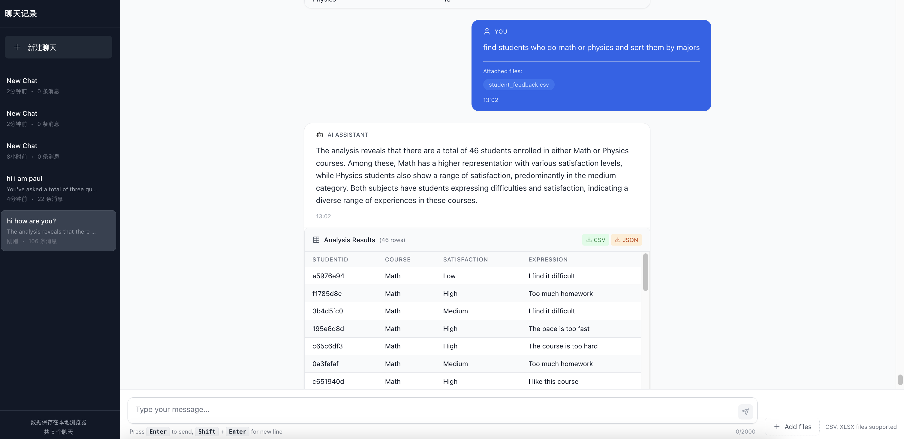
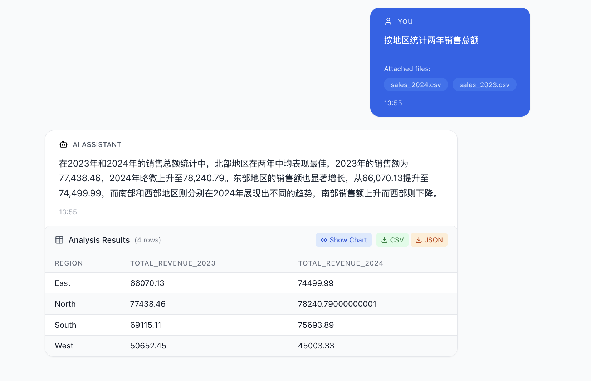
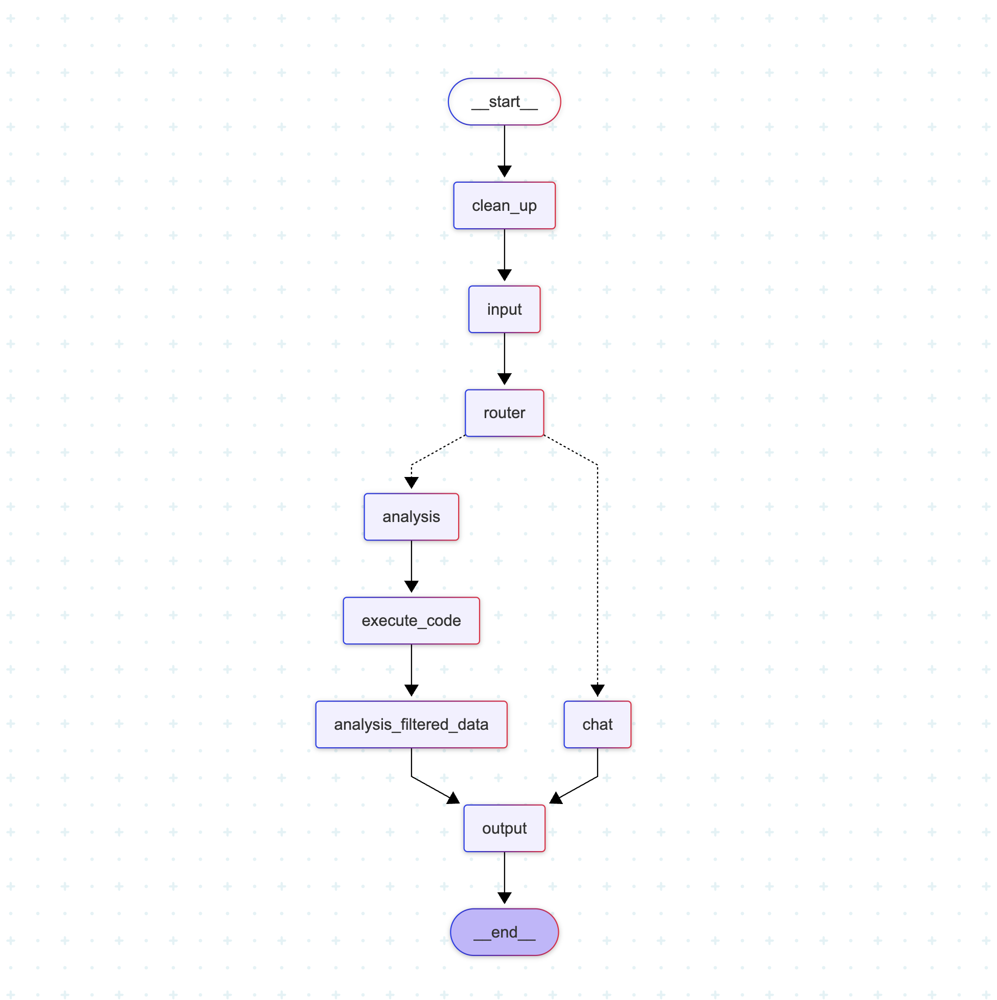

# AI Data Analysis Agent

An AI-powered chat application for data analysis. Upload CSV or Excel files and get intelligent insights.

## [Online Demo](https://data-analyze-agent2.vercel.app/)

## test case



## Graph Visualization


## Features

- 📊 Upload CSV and Excel files
- 🤖 AI-driven data analysis and querying
- 💬 Conversational interface
- 📈 Data visualization (charts)
- 💾 Conversation history
- 📱 Responsive design with mobile support

## Tech Stack

### Backend
- FastAPI - Web framework
- LangChain - AI agent framework
- Pandas - data processing
- OpenAI GPT - language model
- Python 3.8+

### Frontend
- Next.js 14 - React framework
- TypeScript - type safety
- Tailwind CSS - styling framework
- Recharts - data visualization

## Deployment

### Backend Deployment (Render)

1. Ensure `backend/requirements.txt` includes all dependencies:
```txt
fastapi==0.115.11
uvicorn==0.34.1
python-multipart==0.0.20
pandas==2.2.3
tabulate==0.9.0
langchain==0.3.25
langchain-openai==0.2.14
langchain-experimental==0.3.4
langchain-core==0.3.59
langgraph==0.3.31
langgraph-checkpoint==2.0.24
openai==1.75.0
python-dotenv==1.1.0
pydantic==2.11.3
typing-extensions==4.13.2
openpyxl==3.1.5
requests==2.32.3
```

2. Create a new Web Service on Render
3. Connect the GitHub repository
4. Set the build command: `pip install -r backend/requirements.txt`
5. Set the start command: `cd backend && python main.py`
6. Add an environment variable:
   - `OPENAI_API_KEY`: your OpenAI API key

### Frontend Deployment (Vercel)

1. Import the GitHub repository in Vercel
2. Set the root directory to `frontend`
3. Add an environment variable:
   - `NEXT_PUBLIC_API_URL`: backend API URL (e.g. https://your-backend.onrender.com)

## Local Development

### Backend Setup

1. Enter the backend directory:
```bash
cd backend
```

2. Install dependencies:
```bash
pip install -r requirements.txt
```

3. Create a `.env` file:
```env
OPENAI_API_KEY=your_openai_api_key_here
```

4. Start the server:
```bash
python main.py
```

### Frontend Setup

1. Enter the frontend directory:
```bash
cd frontend
```

2. Install dependencies:
```bash
npm install
```

3. Create a `.env.local` file:
```env
NEXT_PUBLIC_API_URL=http://localhost:8000
```

4. Start the development server:
```bash
npm run dev
```

## Usage

1. Open the frontend application
2. Click "Add files" to upload CSV or Excel files
3. Type your question in the chat box, for example:
   - "Analyze the basic statistics of this dataset"
   - "Find the top 10 products by sales"
   - "Show the monthly trend"
4. The AI analyzes the data and returns results with charts

## Troubleshooting

### Common Issues

1. **Network error - "Failed to fetch"**
   - **Problem**: the frontend cannot reach the backend API
   - **Possible causes:**
     - The Render service is waking up (cold start)
     - Network timeout
     - CORS configuration issues
   - **Solutions:**
     - Wait 1–2 minutes for the Render service to fully start
     - Check backend health at `https://dataanalyzeagent2.onrender.com/health`
     - The frontend will automatically retry three times with increasing intervals
     - Inspect the browser console for detailed errors

2. **"Missing optional dependency 'tabulate'" error**
   - **Solution**: ensure `requirements.txt` includes `tabulate==0.9.0`; this is fixed in the latest version

3. **Render cold start issues**
   - **Symptom**: connection fails on first visit or after long inactivity
   - **Solutions:**
     - Wait 30–60 seconds for the service to start
     - Hit the backend health endpoint to warm up the service
     - Consider upgrading to a paid Render plan to avoid cold starts

4. **Environment variables not applied on Vercel**
   - **Check:**
     - Make sure `NEXT_PUBLIC_API_URL` is added in the Vercel project settings
     - The value should be `https://dataanalyzeagent2.onrender.com`
     - Redeploy after changing environment variables

5. **CORS errors**
   - **Symptom**: the browser console shows a CORS policy error
   - **Solution**: the backend is configured to allow the Vercel domain; check domain settings if issues persist

### Deployment Checklist

#### Render Backend Deployment
- [ ] Repository connected to Render
- [ ] Build command: `pip install -r backend/requirements.txt`
- [ ] Start command: `cd backend && python main.py`
- [ ] Environment variable `OPENAI_API_KEY` set
- [ ] Service type "Web Service"
- [ ] Python version 3.8+

#### Vercel Frontend Deployment
- [ ] Repository imported into Vercel
- [ ] Root directory set to `frontend`
- [ ] Environment variable `NEXT_PUBLIC_API_URL` set to backend URL
- [ ] Automatic deployments enabled

### Testing Steps

1. **Backend health check:**
   ```bash
   curl https://dataanalyzeagent2.onrender.com/health
   ```
   Should return: `{"status": "healthy", "temp_dir": "temp_file"}`

2. **Frontend connection test:**
   - Open the frontend application
   - Check the connection status indicator at the top of the page
   - Green means connected, red means failed

3. **Functional test:**
   - Try sending a simple message without files: "Hello"
   - Upload a CSV file and ask: "Analyze this data"

## Environment Variables

### Backend
- `OPENAI_API_KEY`: OpenAI API key (required)

### Frontend
- `NEXT_PUBLIC_API_URL`: backend API URL (required)

## License

MIT License

## Contributing

Contributions via Issues and Pull Requests are welcome!
